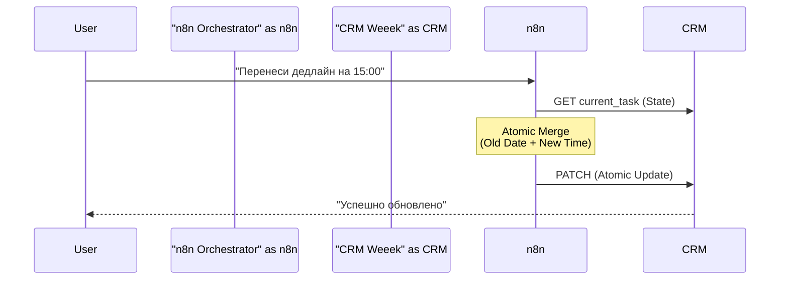

# n8n-crm-sync-gmu


# Industrial CRM Sync: Паттерн Get-Merge-Update (GMU)


## 📌 1. О проекте 
**Какую проблему решаем?** 
При обновлении задач через мессенджеры (Telegram) стандартные боты часто «затирают» важные данные в CRM. Например, менеджер просит перенести время встречи на 15:00, а бот обновляет время, но случайно стирает дату. При одновременных запросах в базе появляются дубликаты.

**Что делает этот проект:** 
Это промышленный интеграционный конвейер. Он не просто слепо записывает команды, а работает по принципу умного слияния. Бот понимает человеческую речь, сверяется с текущим состоянием задачи в CRM и обновляет *только* нужную ячейку, гарантируя 100% сохранность данных.

**Бизнес-контекст и Ограничения:**
*   **Ситуация:** Децентрализованное управление задачами через Telegram при наличии центральной CRM Weeek.
*   **Ограничения:** Стандартные интеграции часто вызывают «конфликты записи»: одновременное обновление приводит к потере данных (Lost Update).
*   **Инженерный вызов:** Реализация транзакционной логики в No-code среде, обеспечивающей консистентность полей при частичном редактировании (изменение времени без затирания даты).

Бизнес-результаты и Метрики
| Метрика | До внедрения | После внедрения (AI) | Бизнес-эффект |
| :--- | :--- | :--- | :--- |
| **Количество дубликатов** | до 15% | 0.0% (на 3000+ опер.) | **Идеальная чистота БД** |
| **Время обновления задачи** | 2 минуты (интерфейс) | 5 секунд (чат-бот) | **Ускорение в 24 раза** |
| **Потеря данных** | Частая при синхронизации | Исключена | **Защита дедлайнов** |

**Executive Summary:**  
Система бесшовной синхронизации данных между мессенджерами и CRM с защитой от дублей и потери дедлайнов.

---

## 🔒 2. Статус проекта и Развертывание (NDA)

> **⚠️ NDA Status:** Исходный код интеграции и ключи доступа к CRM защищены соглашением о неразглашении (NDA). В репозитории представлена логика маршрутизации и архитектурные паттерны.

**Гарантия атомарности (Sanitized Snippet):**
Для предотвращения потери данных в проекте используется строгая типизация входящих NLP-команд через Pydantic. Система разделяет `Date` и `Time` на независимые сущности:

```python
from pydantic import BaseModel, Field
from typing import Optional

class TaskUpdateIntent(BaseModel):
    task_id: str = Field(description="Уникальный Jira-style ID задачи (например, TASK-5)")
    new_date: Optional[str] = Field(None, description="Новая дата, только если явно указана пользователем")
    new_time: Optional[str] = Field(None, description="Новое время, только если явно указано пользователем")
Если new_date равно None, система извлечет старую дату из CRM (этап GET) и склеит её с новым временем (этап MERGE).
```

## 🛠 3. Стек технологий
**n8n (Self-hosted):** Визуальный оркестратор.
Позволяет строить сложные асинхронные цепочки, имеет встроенную базу n8n Workflow Tables и разворачивается внутри контура компании.
**JavaScript (Code Nodes):**
Используется для написания кастомной логики слияния JSON-объектов (Merge) и обработки сложных дат (Luxon).
**Weeek.net API:** Российская CRM-система.
Идеально подходит для импортозамещения зарубежных аналогов (Jira, Trello).

## ⚙️ 4. Архитектура системы
Внедрен паттерн Get-Merge-Update. Отказ от прямых слепых апдейтов. Система всегда извлекает текущее состояние объекта, накладывает новые данные в оперативной памяти и отправляет точечный PATCH.


## 🛡 5. Безопасность и Отказоустойчивость
Интеграция с российской CRM Weeek. Весь workflow изолирован в локальном Docker-контейнере. Реализована Fallback-логика: при сбое API запрос ставится в очередь (Queue) и повторяется автоматически.

> 🗣 Мнение Операционного Директора: "Денис предложил этот паттерн GMU. Сначала казалось избыточным, но по факту — это первая интеграция, которая не потеряла ни одного дедлайна и работает монолитно под нагрузкой."

## 📸 6. Доказательства работы (Proof of Work)
<p align="center">

<br>
<i>Рис 1. Архитектура интеграционного слоя в n8n (20+ узлов маршрутизации, NLP-распознавания и валидации).</i>
</p>
<p align="center">

<br>
<i>Рис 2. Двусторонняя синхронизация: 100% совпадение ID и статусов задач (#29, #31, #32) в локальной таблице и внешней CRM Weeek.</i>
</p>

**🤝 Как мы можем сотрудничать?**
- ✅ Настрою интеграцию ваших систем без "спагетти-кода" и конфликтов записи.
- ✅ Внедрю строгую типизацию обмена данными.
- ✅ Внедрение через Shadow Mode (Zero Downtime).

**Связаться для аудита:** Telegram @dks_persistent_bot  
*(Работа по договору, NDA, DPA)*

